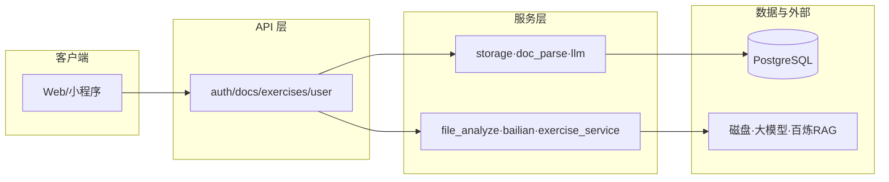
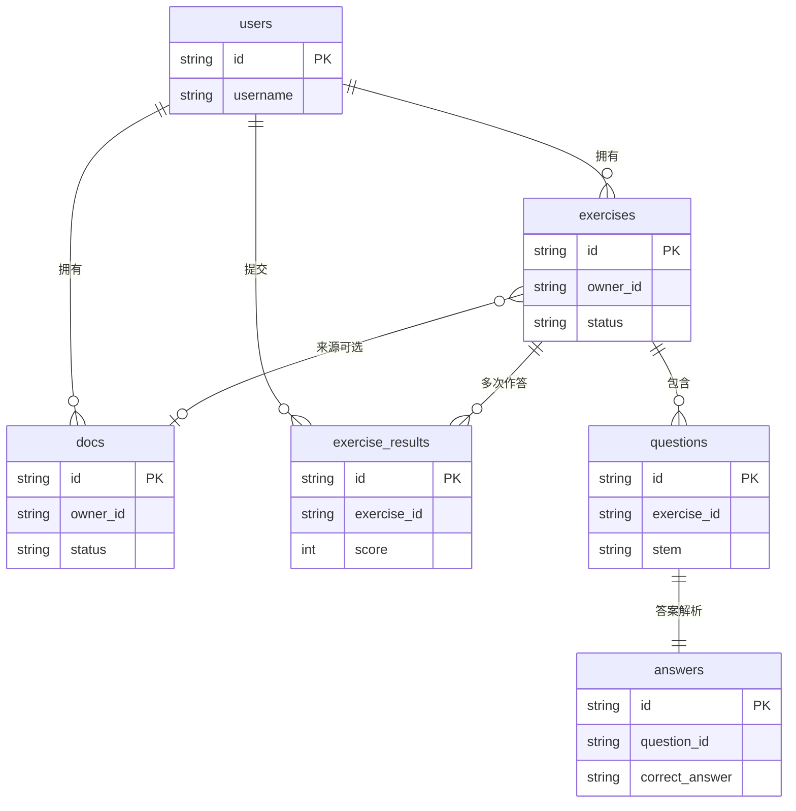
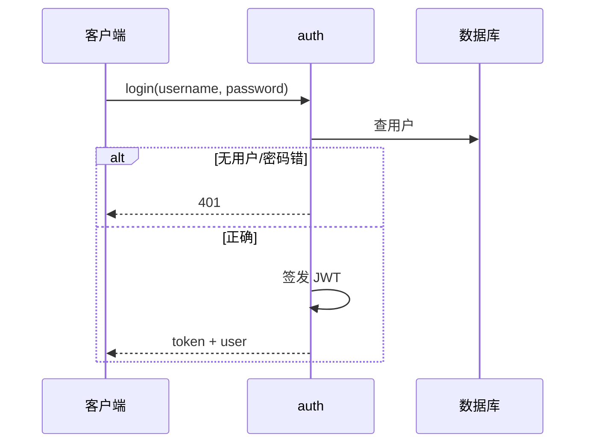
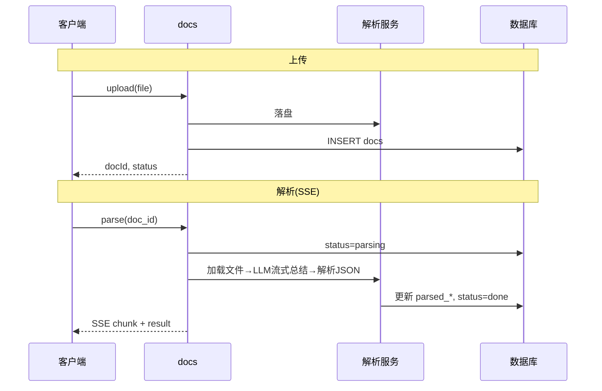
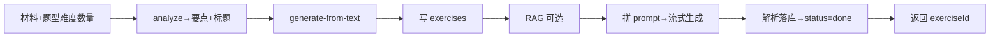
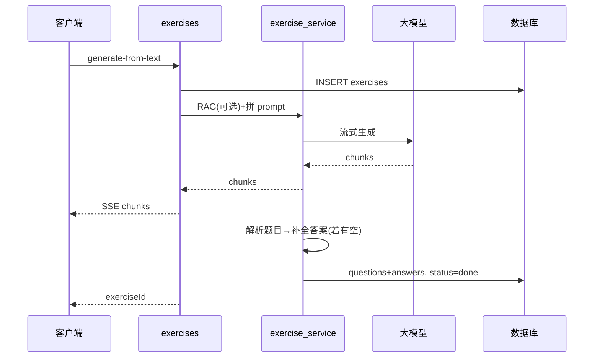
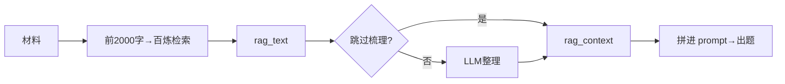
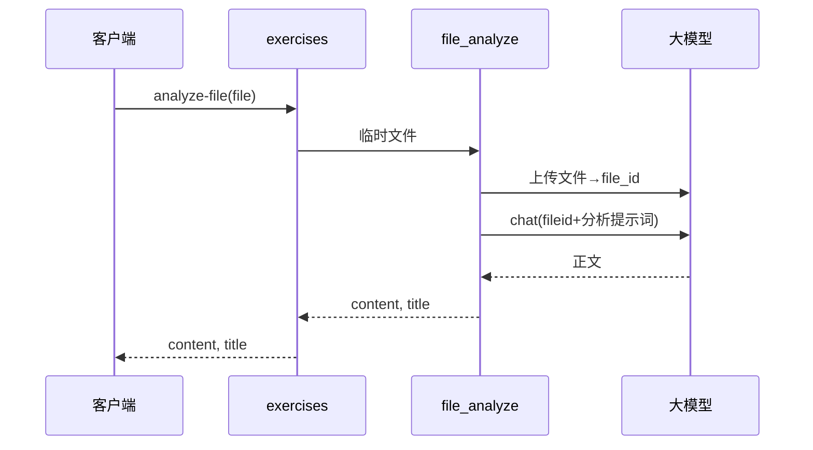
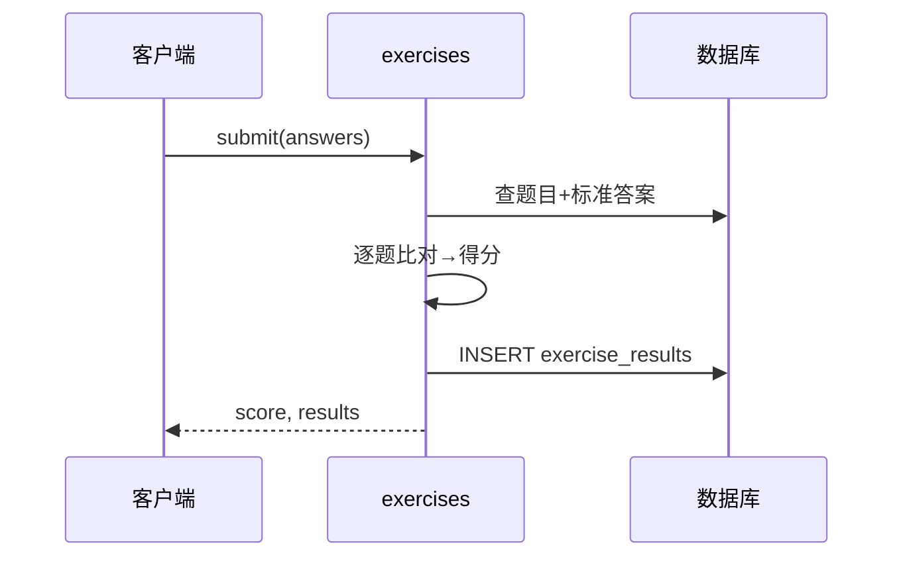

# Lumist ExamAgent 后端架构文档

本文档面向「向别人介绍整个项目」：重点说明**每个核心链路的框架与逻辑**，辅以技术栈说明，图文并茂，覆盖所有核心逻辑。

---

## 一、项目概览

**Lumist ExamAgent** 是一个 **AI 出题与练习** 的后端服务：用户可上传资料或输入文字材料，系统结合大模型与可选的知识库（RAG）生成练习题（单选/多选/判断/填空/简答），用户作答后由系统判分并给出解析。

核心能力概括：

- **资料管理**：上传文档（PDF/DOCX/PPTX/TXT），可选解析并得到结构化摘要（学校、专业、课程、知识点、摘要）。
- **出题**：基于「用户材料 + 题型/难度/数量」流式生成题目；可选接入 RAG 知识库增强上下文。
- **练习**：查看题目、提交答案、客观题自动判分、简答题等由大模型补全答案与解析。

下文按**入口 → 步骤 → 关键逻辑**逐条说明各核心链路，并配流程图或时序图（Mermaid）。

---

## 二、整体架构

系统分层：**API 路由** → **服务层** → **数据与外部依赖**。除登录/注册外，需在请求头携带 `Authorization: Bearer <token>` 做鉴权（部分接口当前使用开发用户占位）。

**技术栈（简要）**：FastAPI、PostgreSQL（SQLAlchemy asyncpg）、本地文件存储、阿里云百炼（大模型 + 知识库 RAG）。文档解析使用 LangChain 加载器（PDF/DOCX/PPTX/TXT）。

---

## 三、数据模型

业务核心实体：**用户**、**资料**、**练习**、**题目**、**答案**、**作答记录**。关系如下。

- **docs**：上传后 `status=uploaded`；发起解析后 `parsing` → 成功 `done` 写入 `parsed_*`，失败 `failed`。
- **exercises**：创建时 `status=generating`；题目解析落库完成后 `done`，异常可置为 `failed`。
- **exercise_results**：每次提交答案生成一条记录，同一练习可多次提交（取最后一次或列表展示）。

---

## 四、核心链路一：认证（登录 / 注册）

**目的**：识别用户身份，后续请求携带 Token。

**入口**：`POST /api/auth/login`、`POST /api/auth/register`。

**逻辑框架**：

- **登录**：按用户名查用户 → 校验密码（bcrypt）→ 通过则签发 JWT（含 user_id），返回 `token` + `user`。
- **注册**：检查用户名是否已存在 → 不存在则对密码做哈希、插入用户表 → 再签发 JWT 并返回，等价于「注册即登录」。

**技术点**：密码用 bcrypt 哈希存储；JWT 由 `core.security` 签发/校验，请求时通过 `deps.get_current_user` 解析 Token 得到当前用户（需要鉴权的接口注入该依赖）。

---

## 五、核心链路二：资料上传与解析

**目的**：用户上传文档并可选「解析」得到结构化摘要，供前端展示或后续出题参考。

**入口**：

- `POST /api/docs/upload` 或 `POST /api/docs/materials/upload`：上传文件。
- `POST /api/docs/{doc_id}/parse`：对已上传的文档发起解析（SSE 流式返回进度与结果）。

**逻辑框架**：

1. **上传**：校验类型（PDF/DOCX/PPTX/TXT）→ 生成 `doc_id`，调用 `storage_service` 将文件写入磁盘（`upload_dir`），可选再复制到资料库目录 → 在 DB 插入一条 `docs` 记录（`status=uploaded`），返回 `docId`、`fileName`、`status`。
2. **解析**：根据 `doc_id` 查出 `doc` 与文件路径 → 将 `doc.status` 置为 `parsing` 并 commit → 使用 `doc_parse_service.parse_and_index_stream`：先用 LangChain 按扩展名加载文件正文，清洗后送入 `llm_service.stream_summarize_document`（提示词中拼入「文档内容」），流式接收模型输出；收齐后解析 JSON 得到学校/专业/课程/知识点/摘要，写回 `doc` 的 `parsed_*` 并 commit，`status=done`；任一步失败则 `status=failed`。SSE 在解析过程中推送 `status`/`progress`/`chunk`/`result` 或 `error`。

**技术点**：文件落盘与删除在 `storage_service`（同步逻辑用 `asyncio.to_thread` 避免阻塞）；文档解析用 LangChain 的 PyPDFLoader、Docx2txtLoader、TextLoader 等；大模型调用走 OpenAI 兼容接口（阿里云百炼），提示词在 `llm_service` 中「固定模板 + 文档内容截断」拼接。

---

## 六、核心链路三：出题（分析材料 → 流式生成 → 解析落库）

**目的**：用户提供「材料」（文字或由文件分析得到），选择题型、难度、数量后，系统流式生成题目并落库，前端可实时展示并随后查看练习详情。

**入口**：

- `POST /api/exercises/analyze`：分析材料，返回出题要点（keyPoints）及建议标题，供用户确认。
- `POST /api/exercises/generate-from-text`：根据确认后的材料与参数流式生成题目，响应为 SSE，末尾带 `exerciseId`。

**逻辑框架**：

1. **分析材料**：请求体含 `content`（用户输入或文件分析得到的文本）、题型、难度、数量。`exercise_service.analyze_material` 用固定提示词（「根据材料提炼要点…」）+ `content[:6000]` 调用大模型，返回 JSON 数组要点；路由层再拼出建议标题（如第一个要点或材料前 30 字），返回给前端展示、用户确认。
2. **流式生成**：
   - 在 DB 中先插入一条 `exercises` 记录（`status=generating`），得到 `exercise_id`。
   - 组合「用户意图」：标题、题型、难度、数量、要点、分析说明等 → `intent_context`。
   - **RAG（可选）**：用用户材料前 2000 字作为 query 调用百炼知识库检索，得到 `rag_text`；若配置了「RAG 梳理」，再调用大模型对 `rag_text` 做整理（去重、分节、加小标题）得到 `rag_context`，否则直接用原文。
   - 调用 `exercise_service.stream_raw_and_collect`：用 `_build_questions_prompt` 拼出完整提示词（格式要求 + 示例 + 【用户意图】+ 【知识库参考】+ 【用户材料】），请求大模型流式生成；边收边向客户端 SSE 下发内容。
   - 流结束后，在**新的 DB Session** 中调用 `parse_and_save_questions`：用正则从完整文本中解析出每道题的题干、选项、答案、解析；若某题答案或解析为空，则仅把该题题干+选项再调大模型补全；通过则写入 `questions` 与 `answers`，最后将 `exercises.status` 置为 `done`；异常可置为 `failed`。流末尾再发一行 JSON `{"exerciseId": "xxx"}` 供前端跳转。

**技术点**：提示词在 `exercise_service._build_questions_prompt` 中拼接（用户意图、知识库参考、用户材料均有长度截断）；流式响应使用 FastAPI `StreamingResponse` + SSE；解析落库与补全答案在流结束后用独立 Session，避免请求级 Session 已关闭的问题。

---

## 七、核心链路四：RAG 与知识库

**目的**：在「根据材料出题」时，用材料内容去知识库检索相关片段，经可选梳理后拼进出题提示词，提高题目与知识库的一致性。

**逻辑框架**：

- **检索**：`bailian_retrieve_service.retrieve_for_question_generation(user_content)` 用用户材料前 2000 字作为 query，调用阿里云百炼知识库 API（`workspace_id` + `index_id` 配置在环境变量），返回若干片段；服务层将片段的 `text` 用 `\n\n` 拼成 `rag_text` 返回给调用方。
- **梳理（可选）**：若未配置 `SKIP_RAG_ANALYZE`，则由 `exercise_service.analyze_rag_context(rag_text)` 将 `rag_text` 再发给大模型，要求按主题分节、去重、加小标题，输出整理后文本作为「知识库参考」拼进 `_build_questions_prompt`；若跳过梳理则直接使用 `rag_text`。
- **拼进 prompt**：在 `_build_questions_prompt` 中，先拼「【用户意图】」，再拼「【知识库参考】」（`rag_context` 截断），最后拼「【用户材料】」。

**技术点**：百炼使用 OpenAPI SDK（`alibabacloud_bailian20231229`），检索为同步调用，在异步路由中用 `asyncio.to_thread` 执行；知识库 ID、业务空间 ID 及是否跳过梳理均来自配置。

---

## 八、核心链路五：上传文件分析（得到出题材料）

**目的**：用户直接上传一个文件（如 PDF），不经过「资料库」流程，由大模型分析文件内容，得到一段适合出题的文本与建议标题，供前端填入「出题材料」并调用「根据文字生成题目」。

**入口**：`POST /api/exercises/analyze-file`（multipart 上传文件）。

**逻辑框架**：路由将上传文件写入临时文件，调用 `file_analyze_service.analyze_file_for_questions(tmp_path)`：通过百炼/Dashscope 的「文件上传」接口上传该文件得到 `file_id`，再发一条对话请求，system 为 `fileid://{file_id}`，user 为固定提示词「请分析这篇文档的内容…提炼出题材料…」；模型返回的正文解析出「标题：xxx」首行（若有）与正文，作为 `content` 和 `title` 返回。路由删除临时文件后把 `content`、`title` 返回给前端，前端可将其作为 `generate-from-text` 的 `content`/`title` 再次请求。

**技术点**：文件内容通过百炼「文件附件」能力传入，不在 user message 里拼文件正文；与「资料解析」链路不同，此处不落库 docs、不写磁盘资料库，仅一次性分析。

---

## 九、核心链路六：提交答案与批改

**目的**：用户对某次练习提交答案，系统根据题目标准答案判对错并返回得分、正确率及每题解析。

**入口**：`POST /api/exercises/{exercise_id}/submit`，请求体为 `{ answers: [{ questionId, answer }] }`。

**逻辑框架**：根据 `exercise_id` 查出该练习下所有题目及已有 `answers` 表（题目对应的标准答案与解析）。遍历每道题：用用户提交的 `answer` 与 `answers.correct_answer` 比对（当前为字符串相等）；统计正确数，算得分与正确率；组装每题的 `isCorrect`、`userAnswer`、`correctAnswer`、`analysis`（来自 `answers.analysis`）。插入一条 `exercise_results` 记录（含 `result_details` JSON），返回得分、正确率及 `results` 列表。同一练习可多次提交，每次一条新 `exercise_result`。

**技术点**：客观题判题为字符串一致；简答题等若在生成题目时已由大模型写出标准答案与解析，则这里直接复用，不做二次调用。如需「简答题 AI 批改」，可在此链路中对某类题目再调大模型比对用户答案与标准答案。

---

## 十、其他接口与逻辑摘要

| 能力 | 入口 | 逻辑要点 |
|------|------|----------|
| 健康检查 | `GET /api/health` | 直接返回 `{ status: "ok" }`，用于探活。 |
| 资料列表 | `GET /api/docs` | 按当前用户（或开发用户）分页查 `docs`，支持 keyword；返回 `items`、`total`。 |
| 资料详情 | `GET /api/docs/{doc_id}` | 查单条 doc，若 `status=done` 则带 `parsed`。 |
| 资料文件预览 | `GET /api/docs/{doc_id}/file` | 按 `doc.file_path` 读磁盘，返回 `FileResponse`。 |
| 删除资料 | `DELETE /api/docs/{doc_id}` | 先解除 exercises 对 doc 的外键引用，再删磁盘文件，最后删 doc 记录。 |
| 练习详情 | `GET /api/exercises/{exercise_id}` | 查 exercise + questions，组装选项与题型展示；若已提交过则带最后一次 score。 |
| 练习列表 | `GET /api/exercises` | 按用户分页，支持 keyword、difficulty、questionType；每条带题目数、最后一次得分。 |
| 删除练习 | `DELETE /api/exercises/{exercise_id}` | 按外键顺序删除：exercise_results → answers → questions → exercise。 |

用户相关：当前部分接口使用 `get_or_create_dev_user` 占位，真实多用户时改为从 `get_current_user` 取 `user.id` 与 `owner_id` 过滤。

---

## 十一、技术栈简表

| 层次 | 技术 | 说明 |
|------|------|------|
| API | FastAPI | 路由、依赖注入、StreamingResponse/SSE。 |
| 鉴权 | JWT + bcrypt | `core.security` 签发/校验；密码哈希存储。 |
| 数据库 | PostgreSQL + SQLAlchemy asyncpg | 异步会话，表：users, docs, exercises, questions, answers, exercise_results。 |
| 文件 | 本地文件系统 | `storage_service`，目录：upload、library。 |
| 文档解析 | LangChain (PyPDFLoader, Docx2txtLoader, TextLoader, pptx) | 按扩展名加载正文，清洗后送大模型。 |
| 大模型 | 阿里云百炼 / DashScope（OpenAI 兼容） | 文档总结、材料分析、RAG 梳理、出题、答案补全。 |
| RAG | 阿里云百炼知识库 API | query=材料前 2000 字，返回片段拼进出题 prompt。 |

---

以上覆盖了从认证、资料上传与解析、出题（含 RAG）、文件分析到提交答案的全部核心链路框架与逻辑。

**如何查看图表**：文档中的 Mermaid 图可在以下环境中直接渲染为图：

- **GitHub**：仓库内打开本文件即可看到流程图、时序图、ER 图。
- **VS Code**：安装 “Markdown Preview Mermaid Support” 后，在预览中查看。
- **Typora / Notion / GitLab**：多数支持 Mermaid 的 Markdown 编辑器均可预览。

若需对某一条链路做「仅技术实现细节」的补充（如具体类名、方法名），可在本文档基础上按模块追加小节。
